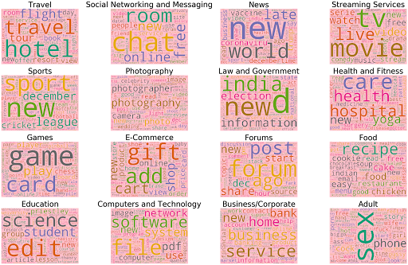
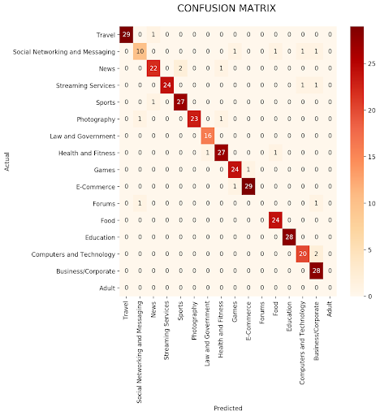

# Domain Classification for the Web

This project aims to classify websites into different domains based on their content. We developed a machine learning model that can predict the category of a website using its URL and parsed text content.

### Demo


### Key Features:
- Dataset creation through web scraping
- Text preprocessing and feature extraction
- Machine learning model selection and training
- Web application for real-time classification


## Methodology

### Dataset Creation
1. Scraped websites using BeautifulSoup
2. Extracted text content from various HTML tags
3. Cleaned and preprocessed text data
4. Categorized websites into 16 predefined categories

### Data Preprocessing and Exploration
- Feature selection: 'website_url', 'cleaned_website_text', and 'Category'
- Created word clouds for each category
 


- Used TfidfVectorizer for text vectorization


### Model Selection
We evaluated multiple machine learning algorithms using 5-fold cross-validation:

```python
# Cross-validation results
models = {
    'RandomForestClassifier': 0.9177 ± 0.0123,
    'LinearSVC': 0.9269 ± 0.0087,
    'MultinomialNB': 0.8896 ± 0.0087,
    'GaussianNB': 0.7750 ± 0.0173
}
```

LinearSVC was chosen as the best performing model.

## Technologies Used

- Python
- Libraries: BeautifulSoup, Flashtext, Spacy, NumPy, Pandas, Seaborn, Matplotlib, Scikit-learn
- Web Framework: Streamlit

## Results

Our LinearSVC model achieved an accuracy of 94.03% on the test set.


### Confusion Matrix



## Web Application

We developed a Streamlit web application with the following features:

1. Real-time website classification
2. Probability prediction for each category
3. Visualization of prediction probabilities
4. Display of correlated terms for each category
5. Option to train and evaluate different models


## Conclusion

This project successfully demonstrates the application of machine learning in classifying websites into predefined categories. The LinearSVC model shows high accuracy, and the web application provides an intuitive interface for users to interact with the classification system.

For more details, please refer to the full project report.
